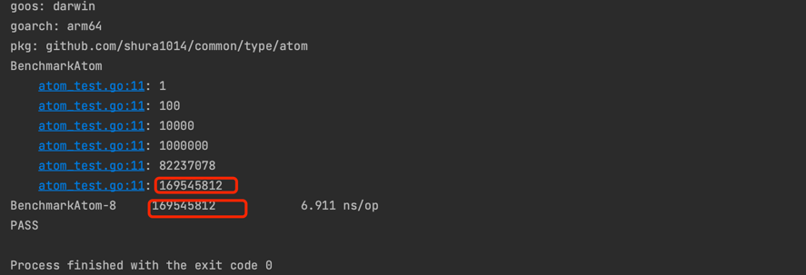

# common

go的常用工具库

# 快速使用

### 容器

#### 队列

先进显出

api

```text
Push
Pop
Peek
Len
IsEmpty
Iterator
```

迭代器使用

```go
func TestQueue_Iterator(t *testing.T) {
    queue := NewQueue[string]()
    queue.Push("1")
    queue.Push("3")
    queue.Push("2")
    queue.Push("8")
    queue.Push("5")
    queue.Iterator(func (v any) {
    t.Log(v)
    })
}


== = RUN   TestQueue_Iterator
queue_test.go:30: 1
queue_test.go:30: 3
queue_test.go:30: 2
queue_test.go:30: 8
queue_test.go:30: 5
--- PASS: TestQueue_Iterator (0.00s)
PASS
```

> 并发测试

```text
go test . -bench . -count 3 -benchmem
goos: darwin
goarch: arm64
pkg: github.com/shura1014/common/container/concurrent
Benchmark_PriorityQueue_Push-8           6973504               152.1 ns/op            69 B/op          1 allocs/op
Benchmark_PriorityQueue_Push-8           7426630               149.1 ns/op            66 B/op          1 allocs/op
Benchmark_PriorityQueue_Push-8           7559865               152.6 ns/op            65 B/op          1 allocs/op
Benchmark_PriorityQueue_POP-8           10717260               108.3 ns/op             0 B/op          0 allocs/op
Benchmark_PriorityQueue_POP-8           11617062               102.0 ns/op             0 B/op          0 allocs/op
Benchmark_PriorityQueue_POP-8           11429590               107.4 ns/op             0 B/op          0 allocs/op
PASS
ok      github.com/shura1014/common/container/concurrent        8.644s
```

#### 带有权重的队列

api

NextPriority
Push
Pop

```go
func TestPriorityQueue(t *testing.T) {
    pQueue := NewPriorityQueue()
    
    pQueue.Push("test10", 10)
    pQueue.Push("test2", 2)
    pQueue.Push("test8", 8)
    pQueue.Push("test11", 11)
    pQueue.Push("test5", 5)
    
    t.Log(pQueue.nextPriority)
    t.Log(pQueue.Pop())
    t.Log(pQueue.nextPriority)
    
    t.Log(pQueue.Pop())
    t.Log(pQueue.nextPriority)
    
    t.Log(pQueue.Pop())
    t.Log(pQueue.nextPriority)
    
    t.Log(pQueue.Pop())
    t.Log(pQueue.nextPriority)
    
    t.Log(pQueue.Pop())

}


== = RUN   TestPriorityQueue
priorityQueue_test.go:16: 2
priorityQueue_test.go:17: test2
priorityQueue_test.go:18: 5
priorityQueue_test.go:20: test5
priorityQueue_test.go:21: 8
priorityQueue_test.go:23: test8
priorityQueue_test.go:24: 10
priorityQueue_test.go:26: test10
priorityQueue_test.go:27: 11
priorityQueue_test.go:29: test11
--- PASS: TestPriorityQueue (0.00s)
PASS
```

#### 栈

先进后出

api

```go
Push
Pop
Peek
Len
IsEmpty
Iterator
```

迭代使用

```go
func TestStack_Iterator(t *testing.T) {
    stack := NewStack[string]()
    stack.Push("1")
    stack.Push("3")
    stack.Push("2")
    stack.Push("8")
    stack.Push("5")

    stack.Iterator(func (v any) {
    t.Log(v)
    })
}


== = RUN   TestStack_Iterator
stack_test.go:31: 5
stack_test.go:31: 8
stack_test.go:31: 2
stack_test.go:31: 3
stack_test.go:31: 1
--- PASS: TestStack_Iterator (0.00s)
PASS
```

#### 带泛型的双向链表

1. 一个节点对应一个value
```go
func TestVList(t *testing.T) {
    type User struct {
        name string
        age  int
    }
    list := NewList[User]()
    list.PushFront(User{name: "name1", age: 10})
    list.PushFront(User{name: "name2", age: 20})
    list.PushFront(User{name: "name3", age: 20})
    
    t.Logf(list.Front().Value.name)
    t.Logf(list.Back().Value.name)
}


=== RUN   TestVList
list_test.go:15: name3
list_test.go:16: name1
--- PASS: TestVList (0.00s)
PASS
```

2. 一个节点对应一个k-v

```go
func TestKVList(t *testing.T) {
	type User struct {
		name string
		age  int
	}
	list := NewMapList[string, User]()
	list.PushFront("key1", User{name: "name1", age: 10})
	list.PushFront("key2", User{name: "name2", age: 20})
	list.PushFront("key3", User{name: "name3", age: 20})
	t.Logf(list.Front().Key)
	t.Logf(list.Front().Value.name)
}


=== RUN   TestKVList
list_test.go:28: key3
list_test.go:29: name3
--- PASS: TestKVList (0.00s)
PASS
```

#### 原子类型
在标准库的基础上封装，使其更加适合开发使用

日常使用
```go
func TestAtom(t *testing.T) {
	num := NewInt64()
	load := num.Load()
	num.Cas(load, load+1)
	
	num.Swap(100)
}
```

并发测试
```go
func BenchmarkAtom(b *testing.B) {
	num := NewInt64()
	for i := 0; i < b.N; i++ {
		num.Add(1)
	}

	b.Log(num.Load())
}
```
最终结果与并发次数一致



#### 环境变量
1. 操作系统环境变量
2. 启动参数变量

> 获取，优先获取启动参数环境变量，获取不到再是操作系统变量

示例
```go
func TestInitArgs(t *testing.T) {
	_ = os.Setenv("a", "a")
	_ = os.Setenv("c", "d")
	args := []string{"--a", "b", "c", "d", "--e", "-f", "g", "-h=i", "--j=k", "l", "-m"}
	InitArgs(args)

	t.Log(GetEnv("a")) // expect b
	t.Log(GetEnv("c")) // expect d
	t.Log(GetAll())
}


输出结果
=== RUN   TestInitArgs
args_test.go:15: b true
args_test.go:16: d true
args_test.go:17: map[a:b e: f:g h:i j:k m: test.paniconexit0: test.run:^\QTestInitArgs\E$ test.v:]
--- PASS: TestInitArgs (0.00s)
PASS
```


#### BKDRHash
```go
func TestBKDRHash64(t *testing.T) {
    hash64 := BKDRHash64([]byte("123"))
    t.Log(hash64)
}

=== RUN   TestBKDRHash64
    bkdr_test.go:7: 847490
--- PASS: TestBKDRHash64 (0.00s)
PASS
```

#### timeutil
> 解析时间

```go
func TestParse(t *testing.T) {
	parse := Parse("Y-M-D H:m:s")
	t.Log(parse)
}

2006-01-02 15:04:05
```

> 当前时间

```go
// 默认 2006-01-02 15:04:05
func TestNow(t *testing.T) {
	t.Log(Now())
}

// 指定格式
func TestNowFormat(t *testing.T) {
t.Log(NowFormat(Parse("Y/M/D")))
}

// 当前毫秒数
func TestMilliSeconds(t *testing.T) {
    t.Log(MilliSeconds())
}
```


> 字符串转time.Duration

```go
func TestConvert(t *testing.T) {
	t.Log(Convert("1000000"))
}
```


#### stringutil

```go
// 驼峰转下划线
func TestUnderline(t *testing.T) {
    t.Log(Underline("AbstractBalance"))
    t.Log(LowUnderline("AbstractBalance"))
    t.Log(UpperUnderline("AbstractBalance"))
}

func TestJoin(t *testing.T) {
    t.Log(Join("a", "b", "c")) // anc
}

func TestIsArray(t *testing.T) {
t.Log(IsArray([]string{"a", "b"}, "a")) // true
}

func TestToString(t *testing.T) {
    t.Log(ToString([]byte{'1', '2'})) // 12
    t.Log(ToString(100))              // 100
    t.Log(ToString(true))             // true
    t.Log(ToString(time.Now()))       // 2023-08-18 14:45:03.316659 +0800 CST m=+0.000671251
}

func TestIsNumeric(t *testing.T) {
    t.Log(IsNumeric("12")) // true
    t.Log(IsNumeric("xx")) // false
}

func TestStringToBytes(t *testing.T) {
    t.Log(StringToBytes("123")) // [49 50 51]
}
```

#### 反射工具

```go
type User struct {
	Name string
	Age  int
}

func TestIndirectType(t *testing.T) {
	v := Indirect(&User{})
	k := IndirectKind(&User{})
	ty := IndirectType(&User{})
	t.Logf("%+v\n", v) // {Name: Age:0}
	t.Logf("%+v\n", k) // struct
	t.Logf("%+v", ty)  // reflectutil.User
}
func TestNewData(t *testing.T) {
	ty := IndirectType(&User{})
	data := NewData(ty)
	t.Logf("%+v", data) // &{Name: Age:0}
}

func TestGetName(t *testing.T) {
	name := GetName(&User{})
	t.Log(name) // User
}

func TestIsPointer(t *testing.T) {
	t.Log(IsPointer(&User{})) // true
	t.Log(IsPointer(User{}))  // false
}

func TestConvertType(t *testing.T) {
	u := [2]any{"hello", 18}
	v1 := reflect.ValueOf(u)
	v2 := reflect.ValueOf(&User{})

	for i := range u {
		convertType := ConvertType(v1, i, v2, i)
		v2.Elem().Field(i).Set(convertType)
	}

	t.Log(v2) // &{hello 18}
}
```

#### objectutil
判断是否是零值
```go
func TestIsZero(t *testing.T) {
	t.Log(IsZero(0))
	t.Log(IsZero(1))
	t.Log(IsZero(""))
	t.Log(IsZero("1"))
	t.Log(IsZero(time.Duration(0)))
	t.Log(IsZero(time.Duration(1)))
	t.Log(IsZero(nil))
	t.Log(IsZero(make(map[string]any)))
}


=== RUN   TestIsZero
empty_test.go:9: true
empty_test.go:10: false
empty_test.go:11: true
empty_test.go:12: false
empty_test.go:13: true
empty_test.go:14: false
empty_test.go:15: true
empty_test.go:16: true
--- PASS: TestIsZero (0.00s)
PASS
```

#### iputil
ip 与 uint32转换

```go
func TestIpv4ToUint32(t *testing.T) {
	ip := "192.168.1.1"
	ipInt := Ipv4ToUint32(ip)
	t.Log(ipInt)
	t.Log(Uint32ToIpv4(ipInt))
}


=== RUN   TestIpv4ToUint32
ipv4_test.go:8: 3232235777
ipv4_test.go:9: 192.168.1.1
--- PASS: TestIpv4ToUint32 (0.00s)
PASS
```

GetMac

GetMacArray

GetIpArray

#### fileutil
```go
ExtName 扩展名
IsFile 判断是否是文件
FileName 返回文件名 /opt/temp.txt -> temp.txt
RealPath 绝对路径
Exists 是否存在
Join 拼接路径
JoinCurrent 与当前路径做拼接
IsDir 是否是目录
ListFileName 列出目录下的文件名字
ReadFile(file io.Reader) []string 按行读取文件
ReadBytes(fileName string) []byte 读取内容
```

#### byteutil

```go
func TestToByte(t *testing.T) {
	type T struct {
		data any
	}

	t.Log(ToByte(&T{}))
	t.Log(ToByte("11111"))

}

[38 123 60 110 105 108 62 125]
[49 49 49 49 49]
```

#### binaryutil

```go
func TestToByte(t *testing.T) {
	data := []any{"1", 2, false, []int32{1, 2, 3}, map[string]any{"name": "wendell"}}
	toByte := Encode(data)
	t.Log(toByte)
	decode := make([]byte, len(toByte))
	//decode := DecodeToString(toByte)
	_ = Decode(toByte, decode)
	t.Log(string(decode))
}

[91 49 32 50 32 102 97 108 115 101 32 91 49 32 50 32 51 93 32 109 97 112 91 110 97 109 101 58 119 101 110 100 101 108 108 93 93]
[1 2 false [1 2 3] map[name:wendell]]
```

#### 协程Id

```go
func TestId(t *testing.T) {
	for i := 0; i < 1; i++ {
		go func() {
			t.Log(GoID())
			t.Log(GoID())
			t.Log(GoID())
			t.Log(GoID())
			t.Log(GoID())
			t.Log(GoID())
			t.Log(GoID())
			t.Log(GoID())
		}()
	}
	Wait()
}

goid_test.go:10: 5
goid_test.go:11: 5
goid_test.go:12: 5
goid_test.go:13: 5
goid_test.go:14: 5
goid_test.go:15: 5
goid_test.go:16: 5
goid_test.go:17: 5
```

#### 异常

```go
func TestWrap(t *testing.T) {
	e1 := Text("%s is not nil", "user")
	e2 := Wrap(errors.New("failed"))
	t.Log(e1)
	t.Log(e2)
}

500:user is not nil
500:failed

func TestAssert(t *testing.T) {
	IsTrue(1 == 2, &ErrorCode{5000, "%s is not nil"}, "data")
}

panic: 5000:data is not nil [recovered]
    panic: 5000:data is not nil
```


#### 随机数

> 一定范围的随机数数字

[-100, 100]
```go
func TestCacheIntRange(t *testing.T) {
	for i := 0; i < 5; i++ {
		n := IntRange(-100, 100)
		t.Log(n)
	}
}

rand_test.go:62: -89
rand_test.go:62: 57
rand_test.go:62: -93
rand_test.go:62: 29
rand_test.go:62: 31
```

[0,100]

```go
func TestCacheInt(t *testing.T) {
	for i := 0; i < 5; i++ {
		n := Int(100)
		t.Log(n)
	}
}

rand_test.go:57: 71
rand_test.go:57: 29
rand_test.go:57: 95
rand_test.go:57: 58
rand_test.go:57: 81
```
> 随机字符串

```go
func TestCacheLetter(t *testing.T) {
    for i := 0; i < 5; i++ {
        n := Letter(6)
        t.Log(n)
    }
}

rand_test.go:72: YvcHmN
rand_test.go:72: bwYOCs
rand_test.go:72: vVpXRi
rand_test.go:72: xoGekK
rand_test.go:72: RVFtxV
```

> 随机数组，可做验证码用

```go
func TestCacheNumber(t *testing.T) {
	for i := 0; i < 5; i++ {
		n := Number(6)
		t.Log(n)
	}
}

rand_test.go:95: 308731
rand_test.go:95: 448945
rand_test.go:95: 645275
rand_test.go:95: 630683
rand_test.go:95: 627937
```

> 随机数字加字符串

```go
func TestCacheW(t *testing.T) {
	for i := 0; i < 5; i++ {
		n := W(10)
		t.Log(n)
	}
}

rand_test.go:79: 6fxrzrVB5y
rand_test.go:79: cye8y9a1bN
rand_test.go:79: l10R8yTJ1D
rand_test.go:79: 5pfukRYuSd
rand_test.go:79: emx9T03wMN
```

> 随机符号

```go
func TestCacheSymbols(t *testing.T) {
	for i := 0; i < 5; i++ {
		n := Symbols(6)
		t.Log(n)
	}
}

rand_test.go:67: *=*~'|
rand_test.go:67: ?@>-:*
rand_test.go:67: -[#<_$
rand_test.go:67: /-$*<+
rand_test.go:67: {&\#*>
```

> 字母+数字+符号 通常可以作为主机密码使用

```go
func TestCacheChar(t *testing.T) {
	for i := 0; i < 5; i++ {
		n := Char(16)
		t.Log(n)
	}
}

rand_test.go:88: [s2{udc]29!z?<\?
rand_test.go:88: )_$n>6+_3>ij={"R
rand_test.go:88: %J\6@mH/^sgm0k@F
rand_test.go:88: :M_qx*`<;Zw!.8;~
rand_test.go:88: '[y!`uuZEW{~.o$/
```

> 并发测试

BenchmarkByte 为原生的rand
带Cache的是该项目的缓存random
```text
go test . -bench . -count 3 -benchmem
goos: darwin
goarch: arm64
pkg: github.com/shura1014/common/random
BenchmarkByte-8                  4164952               275.2 ns/op             4 B/op          1 allocs/op
BenchmarkByte-8                  4362609               273.0 ns/op             4 B/op          1 allocs/op
BenchmarkByte-8                  4339522               276.2 ns/op             4 B/op          1 allocs/op
BenchmarkCacheByte-8            10571696               122.5 ns/op            12 B/op          1 allocs/op
BenchmarkCacheByte-8             9977851               119.7 ns/op            11 B/op          1 allocs/op
BenchmarkCacheByte-8            10061679               120.3 ns/op            12 B/op          1 allocs/op
BenchmarkCacheInt-8             15179169                78.85 ns/op           36 B/op          1 allocs/op
BenchmarkCacheInt-8             15071653                78.77 ns/op           36 B/op          1 allocs/op
BenchmarkCacheInt-8             15078944                78.81 ns/op           36 B/op          1 allocs/op
BenchmarkCacheIntRange-8         7593460               157.7 ns/op            72 B/op          2 allocs/op
BenchmarkCacheIntRange-8         7505798               158.0 ns/op            72 B/op          2 allocs/op
BenchmarkCacheIntRange-8         7566901               157.8 ns/op            72 B/op          2 allocs/op
PASS
ok      github.com/shura1014/common/random      16.735s
```
性能有一定的提升


#### 协程池

```go
func TestPool(t *testing.T) {
	pool, _ := NewPool(10)
	for i := 0; i < 10; i++ {
		i := i
		_ = pool.Execute(context.TODO(), func(ctx context.Context) {
			t.Logf("i:%d", i)
		})
	}
    common.Wait()
}


gopool_test.go:48: i:4
gopool_test.go:48: i:1
gopool_test.go:48: i:0
gopool_test.go:48: i:2
gopool_test.go:48: i:7
gopool_test.go:48: i:5
gopool_test.go:48: i:6
gopool_test.go:48: i:8
gopool_test.go:48: i:9
gopool_test.go:48: i:3
```

> 并发测试

```go
=== RUN   TestNoPool
    gopool_test.go:71: memory usage:110 MB
--- PASS: TestNoPool (0.46s)
PASS


=== RUN   TestHasPool
gopool_test.go:96: memory usage:73 MB
gopool_test.go:97: running worker:10000
gopool_test.go:98: free worker:0
--- PASS: TestHasPool (1.37s)
PASS
```

使用内存有所降低


#### 路由前缀树
```go
func TestTree(t *testing.T) {
	root := Node{Name: "/", Children: make([]*Node, 0)}

	root.Put("/user/Get/:id")
	root.Put("/user/ha/:id/:q")
	root.Put("/user/Put/*")
	root.Put("/user/create/hello")
	root.Put("/order/Get/hello")
	root.Put("/order/Get/ha/**")
	root.Put("/hello")
	root.Put("/product/*/id")

	nodes := [...]string{
		"/user/Get/1",
		"/user/Get/aaa",
		"/user/Get/aaa/11",
		"/user/Put/ssss",
		"/user/create/hello",
		"/user/create",
		"/order/Get/hello",
		"/order/Get/no",
		"/order/Get/ha/dhdlhlfw/ddddd",
		"/user/ha/dhdlhlfw/ddddd",
		"/hello",
		"/product/phone/id",
		"/product/phone/xx",
	}

	for _, node := range nodes {
		p := make(Keys)
		result := root.Get(node, p)
		fmt.Printf("%-30s | %v %v\n", node, result, p)
	}

}
```

```text
=== RUN   TestTree
/user/Get/1                    | &{:id [] /user/Get/:id true id true false} map[id:1]
/user/Get/aaa                  | &{:id [] /user/Get/:id true id true false} map[id:aaa]
/user/Get/aaa/11               | <nil> map[id:aaa]
/user/Put/ssss                 | &{* [] /user/Put/* true  false false} map[]
/user/create/hello             | &{hello [] /user/create/hello true  false false} map[]
/user/create                   | &{create [0x14000068540] /user/create false  false false} map[]
/order/Get/hello               | &{hello [] /order/Get/hello true  false false} map[]
/order/Get/no                  | <nil> map[]
/order/Get/ha/dhdlhlfw/ddddd   | &{** [] /order/Get/ha/** true FullMatchKey true true} map[FullMatchKey:dhdlhlfw]
/user/ha/dhdlhlfw/ddddd        | &{:q [] /user/ha/:id/:q true q true false} map[id:dhdlhlfw q:ddddd]
/hello                         | &{hello [] /hello true  false false} map[]
/product/phone/id              | &{id [] /product/*/id true  false false} map[]
/product/phone/xx              | <nil> map[]
--- PASS: TestTree (0.00s)
PASS
```